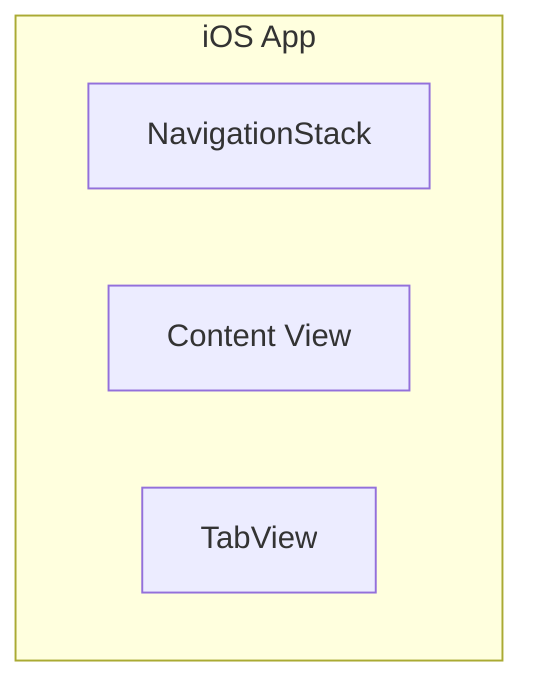
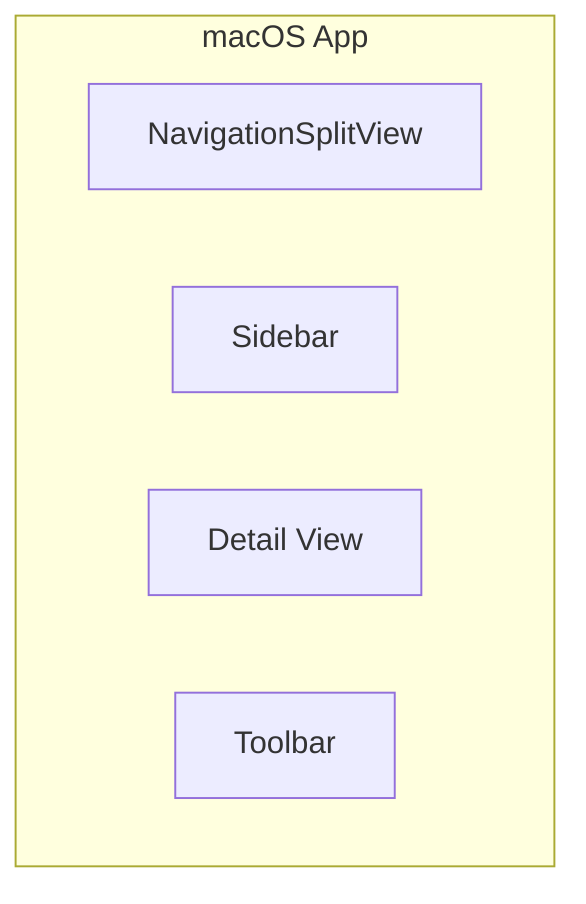

# Pencil Design Tools

AI-powered design tools for Claude Code and Claude Cowork.

**Supports all Apple platforms:** iOS, macOS, iPadOS, watchOS, tvOS, visionOS

---

## Tutorial: From Idea to SwiftUI Code

This guide shows how to use Pencil Design Tools with Claude Cowork and Pencil.dev to create professional UI mockups and generate production-ready SwiftUI code.

### The Workflow


| Step | Action | Tool |
|------|--------|------|
| **1. Describe** | Write natural language description | Claude Cowork |
| **2. Design** | AI creates visual mockup | Pencil.dev |
| **3. Validate** | Check against Apple HIG | `/ux-review` |
| **4. Generate** | Export to SwiftUI code | `/swiftui` or `/swift` |

---

## Quick Start

### Step 1: Open Claude Cowork with Pencil.dev

Make sure Pencil MCP server is configured and Pencil.dev app is running.

### Step 2: Create a Mockup

```
/pencil-design-tools:mockup Login screen with email, password, and social login buttons
```

**What happens:**
1. Claude analyzes your description
2. Creates a visual mockup in Pencil.dev canvas
3. Returns a screenshot for your spec document

**Example output:**

```
┌─────────────────────────────────┐
│        Welcome Back             │
│      Sign in to continue        │
│                                 │
│  ┌─────────────────────────┐   │
│  │ Email address           │   │
│  └─────────────────────────┘   │
│  ┌─────────────────────────┐   │
│  │ Password                │   │
│  └─────────────────────────┘   │
│                                 │
│  Forgot password?               │
│                                 │
│  ┌─────────────────────────┐   │
│  │       Sign In           │   │
│  └─────────────────────────┘   │
│                                 │
│           - or -                │
│                                 │
│      [G]  [Apple]               │
└─────────────────────────────────┘
```

### Step 3: Validate UX (Optional but Recommended)

```
/pencil-design-tools:ux-review
```

**Returns checklist like:**
- ✅ Touch targets meet 44pt minimum (iOS)
- ✅ Color contrast WCAG AA compliant
- ⚠️ Consider adding "Show password" toggle
- ✅ Social login buttons follow platform conventions

### Step 4: Generate SwiftUI Code

```
/pencil-design-tools:swiftui
```

**Generates production-ready code:**

```swift
struct LoginView: View {
    @State private var email = ""
    @State private var password = ""

    var body: some View {
        VStack(spacing: 24) {
            header
            inputFields
            forgotPassword
            signInButton
            socialLogin
        }
        .padding()
    }

    private var header: some View {
        VStack(spacing: 8) {
            Text("Welcome Back")
                .font(.largeTitle)
                .fontWeight(.bold)
            Text("Sign in to continue")
                .foregroundStyle(.secondary)
        }
    }

    // ... more code
}

#Preview {
    LoginView()
}
```

---

## Available Skills

### `/pencil-design-tools:mockup`
Create UI mockups from natural language descriptions using Pencil.dev.

```
/pencil-design-tools:mockup Login screen with email, password, and social login
/pencil-design-tools:mockup macOS settings window with sidebar
/pencil-design-tools:mockup visionOS immersive view with floating panels
```

**Output:**
- Visual mockup in Pencil.dev
- Screenshot saved to `docs/mockups/`
- Markdown snippet for spec documents

---

### `/pencil-design-tools:swiftui`
Convert existing Pencil designs to SwiftUI code for any Apple platform.

```
/pencil-design-tools:swiftui
```

**Output:**
- SwiftUI View structs (works on all Apple platforms)
- Color theme from design variables
- Proper layout with VStack/HStack/ZStack
- Platform-appropriate modifiers

---

### `/pencil-design-tools:design`
Combined workflow - mockup + optional SwiftUI conversion.

```
/pencil-design-tools:design Settings page for macOS app -> SwiftUI
/pencil-design-tools:design iOS onboarding flow -> SwiftUI
```

---

### `/pencil-design-tools:ux-review`
Validate mockups against UX best practices and Apple Human Interface Guidelines.

```
/pencil-design-tools:ux-review
```

**Checks:**
- Touch/click target sizes (44pt iOS, 24pt macOS)
- Color contrast (WCAG compliance)
- Cognitive load (too many choices?)
- Platform conventions (Apple HIG)
- Error prevention & recovery
- Loading & empty states

---

### `/pencil-design-tools:swift`
Generate SwiftUI code directly from description (no visual mockup step).

```
/pencil-design-tools:swift Login form with email and password
/pencil-design-tools:swift macOS settings window with sidebar --platform macos
/pencil-design-tools:swift Video card with thumbnail and duration badge
```

**Use when:** You know what you want and prefer iterating in Xcode's live preview.

---

## Platform Examples

### iOS (Default)

```
/pencil-design-tools:mockup Onboarding carousel with 3 feature slides
```



### macOS

```
/pencil-design-tools:mockup Video encoder app with sidebar, queue list, and encoding progress
```



### watchOS

```
/pencil-design-tools:mockup Workout summary with heart rate and calories
```

### visionOS

```
/pencil-design-tools:mockup Immersive media player with floating controls
```

---

## Installation

### Option 1: From Local Marketplace

```bash
# Add the marketplace (one time)
/plugin marketplace add ~/Developer/claude-plugins/kjetil-marketplace

# Install the plugin
/plugin install pencil-design-tools@kjetil-plugins
```

### Option 2: Direct from GitHub

```bash
# Clone the repository
git clone https://github.com/kjetilge/pencil-design-tools.git ~/Developer/claude-plugins/pencil-design-tools

# Add to your project's .claude/settings.json
```

### Option 3: For Development (Iterative Testing)

```bash
# Run Claude Code with the plugin loaded directly
claude --plugin-dir ~/Developer/claude-plugins/pencil-design-tools
```

---

## Requirements

- **Pencil MCP Server** must be configured in Claude Code/Cowork
- **Pencil.dev** editor app for visual design

### Configuring Pencil MCP

Add to your MCP settings:

```json
{
  "mcpServers": {
    "pencil": {
      "command": "npx",
      "args": ["-y", "@anthropic/pencil-mcp"]
    }
  }
}
```

---

## Mapping Reference

### .pen → SwiftUI

| Pencil | SwiftUI |
|--------|---------|
| `frame` + `layout: "vertical"` | `VStack` |
| `frame` + `layout: "horizontal"` | `HStack` |
| `frame` (no layout) | `ZStack` |
| `fill_container` | `.frame(maxWidth: .infinity)` |
| `cornerRadius` | `.clipShape(RoundedRectangle)` |
| `padding` | `.padding()` |
| `gap` | `spacing:` parameter |
| `fill` (color) | `.background()` or `Color()` |
| `text` | `Text()` |
| `fontSize` | `.font(.system(size:))` |
| `fontWeight` | `.fontWeight()` |

---

## Best Practices

### 1. Start with Clear Descriptions

❌ Bad: "Make a screen"

✅ Good: "Login screen with email field, password field with show/hide toggle, forgot password link, primary sign in button, and Google/Apple social login options"

### 2. Specify Platform When Needed

```
/pencil-design-tools:mockup Settings window --platform macos
```

### 3. Review Before Generating Code

Always run `/ux-review` before generating SwiftUI code to catch issues early.

### 4. Iterate Visually First

Use Pencil.dev canvas to refine the design before generating code. It's faster to iterate visually than in code.

### 5. Use Direct SwiftUI for Known Patterns

If you know exactly what you want (e.g., "standard list with search"), use `/swift` to skip the visual step:

```
/pencil-design-tools:swift Searchable list of videos with thumbnail, title, and duration
```

---

## Directory Structure

```
pencil-design-tools/
├── .claude-plugin/
│   └── plugin.json          # Plugin manifest
├── skills/
│   ├── mockup-generator/
│   │   └── SKILL.md         # /mockup skill
│   ├── pen-to-swiftui/
│   │   └── SKILL.md         # /swiftui skill
│   ├── ux-review/
│   │   └── SKILL.md         # /ux-review skill
│   └── swiftui-direct/
│       └── SKILL.md         # /swift skill
├── commands/
│   └── design.md            # /design command
└── README.md
```

---

## Troubleshooting

### "Pencil MCP not found"

Make sure Pencil.dev app is running and MCP server is configured in Claude settings.

### "No active document"

Open Pencil.dev and create or open a .pen file before running mockup commands.

### Skills Not Appearing

1. Check plugin is in correct directory
2. Verify `.claude-plugin/plugin.json` exists
3. Restart Claude Code/Cowork

---

## Contributing

Contributions welcome! Please open an issue or PR on GitHub.

---

## License

MIT

---

## Author

**Kjetil Geirbo**
kjetil@geirbo.no

GitHub: [@kjetilge](https://github.com/kjetilge)
